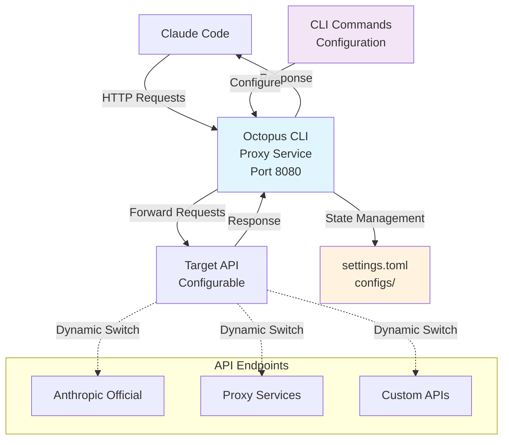

# Octopus CLI

> **English** | [中文](README_CN.md)

[](https://opensource.org/licenses/MIT)
[](https://goreportcard.com/report/github.com/VibeAny/octopus-cli)
[](https://github.com/VibeAny/octopus-cli)
[](test/reports/test-report.md)

> 🐙 A command-line tool for dynamic Claude Code API management and forwarding

## Overview

Octopus CLI is a powerful command-line tool that solves the pain point of frequently switching Claude Code API providers. Instead of manually modifying environment variables and restarting Claude Code each time, Octopus CLI provides a local proxy service that allows you to dynamically switch between multiple API configurations without any restarts.

## Key Features

- 🔀 **Dynamic API Switching** - Switch between API providers instantly without restarts
- 📄 **TOML Configuration** - Clean, readable configuration format
- 💻 **CLI Interface** - Intuitive command-line operations with colorized output
- 📝 **Config Editor** - Edit configuration files with your system's default editor
- 🔄 **Local Proxy** - Transparent HTTP proxy for Claude Code
- 🏥 **Health Checking** - Monitor API endpoint availability
- 📊 **Request Logging** - Track and monitor API usage with real-time log following
- 🔒 **Secure** - API keys stored securely with proper permissions
- 🎨 **Beautiful UI** - Colorized tables and status indicators with proper alignment
- 🚀 **Auto Upgrade** - Seamless upgrade system with GitHub Releases integration
- 🌍 **Multi-Platform** - Native binaries for Windows, macOS, Linux (all architectures)

## Quick Start

### Installation

**One-Command Install (Recommended):**

#### Install latest version with one command

```bash
curl -fsSL https://raw.githubusercontent.com/VibeAny/octopus-cli/main/install.sh | bash
```

#### Or using wget

```bash
wget -qO- https://raw.githubusercontent.com/VibeAny/octopus-cli/main/install.sh | bash
```

**Download Pre-built Binaries:**

```bash
# Available platforms:
# - Windows: amd64, arm64, 386
# - macOS: amd64, arm64
# - Linux: amd64, arm64, 386

# Example for macOS ARM64 (Apple Silicon)
wget https://github.com/VibeAny/octopus-cli/releases/latest/download/octopus-v0.0.3-macos-arm64-YYYYMMDD.xxxxxxxx
chmod +x octopus-v0.0.3-macos-arm64-*
sudo mv octopus-v0.0.3-macos-arm64-* /usr/local/bin/octopus
```

**Build from Source:**

```bash
git clone https://github.com/VibeAny/octopus-cli.git
cd octopus-cli
make build          # Build for current platform
make build-all      # Build for all platforms
```

### Basic Usage

```bash
# 1. Add API configurations
octopus config add official https://api.anthropic.com sk-ant-xxx
octopus config add proxy1 https://api.proxy1.com pk-xxx

# 2. Start the proxy service
octopus start

# 3. Configure Claude Code environment variables
export ANTHROPIC_BASE_URL="http://localhost:8080"
export ANTHROPIC_API_KEY="dummy-key-will-be-overridden"

# 4. Now you can switch APIs dynamically:
octopus config switch proxy1
octopus config switch official

# 5. Check status and health
octopus status
octopus health

# 6. Keep your installation up to date:
octopus upgrade --check    # Check for updates
octopus upgrade           # Upgrade to latest version
```

### Claude Code Configuration

After installing Octopus CLI, you need to configure Claude Code to use the local proxy:

#### Method 1: Environment Variables (Recommended)

**Linux/macOS:**
```bash
# Add to your ~/.bashrc, ~/.zshrc, or ~/.profile
export ANTHROPIC_BASE_URL="http://localhost:8080"
export ANTHROPIC_API_KEY="dummy-key"  # Will be overridden by Octopus

# Reload your shell or run:
source ~/.bashrc  # or ~/.zshrc
```

**Windows PowerShell:**
```powershell
# Add to your PowerShell profile
[Environment]::SetEnvironmentVariable("ANTHROPIC_BASE_URL", "http://localhost:8080", "User")
[Environment]::SetEnvironmentVariable("ANTHROPIC_API_KEY", "dummy-key", "User")

# Or set for current session only:
$env:ANTHROPIC_BASE_URL = "http://localhost:8080"
$env:ANTHROPIC_API_KEY = "dummy-key"
```

**Windows Command Prompt:**
```cmd
# Set permanently
setx ANTHROPIC_BASE_URL "http://localhost:8080"
setx ANTHROPIC_API_KEY "dummy-key"

# Or set for current session only:
set ANTHROPIC_BASE_URL=http://localhost:8080
set ANTHROPIC_API_KEY=dummy-key
```

#### Method 2: Claude Code Settings

Configure Claude Code through its settings interface to use the local proxy endpoint `http://localhost:8080`. The exact method depends on your Claude Code version and interface.

Consult Claude Code's documentation for the specific configuration method for your version.

#### Verification

To verify the configuration is working:

```bash
# Start Octopus CLI
octopus start

# Check that Claude Code is using the proxy
octopus logs -f

# You should see requests from Claude Code in the logs
```

## Recent Updates

### v0.0.3 (Latest) - PID File Management & Status Fix

This patch release fixes a critical issue where the `octopus status` command consistently showed "Stopped" even when the service was running.

**Key Improvements:**
- ✅ **Fixed Status Detection**: Status command now correctly shows "Running" when service is active
- ✅ **Simplified Configuration**: Removed configurable PID file paths - now uses system temp directory automatically
- ✅ **Cross-Platform Compatibility**: Improved temp directory handling across Windows, macOS, and Linux
- ✅ **Enhanced Debugging**: Added PID file path display in status command for troubleshooting
- ✅ **Test Coverage**: All tests updated and passing with 100% success rate

**Technical Changes:**
- Removed `pid_file` configuration option from server settings (breaking change)
- Process managers now use unified PID file management
- Fixed platform detection for upgrade system consistency

**Migration Note:** If you have a custom `pid_file` setting in your configuration, it will be ignored. The system now automatically manages PID files in the system temp directory.

## Commands

### Service Management

- `octopus start` - Start the proxy service
- `octopus stop` - Stop the proxy service
- `octopus status` - Show service status
- `octopus restart` - Restart the service

### Configuration Management

- `octopus config list` - List all API configurations
- `octopus config add <name> <url> <key>` - Add new API configuration
- `octopus config switch <name>` - Switch to specific API configuration
- `octopus config show <name>` - Show configuration details
- `octopus config remove <name>` - Remove API configuration
- `octopus config edit` - Edit configuration file with system editor

### Monitoring & Diagnostics

- `octopus health` - Check API endpoints health status
- `octopus logs` - View service logs
- `octopus logs -f` - Follow service logs in real-time
- `octopus version` - Show version information

### Software Management

- `octopus upgrade` - Upgrade to the latest version
- `octopus upgrade --check` - Check for available upgrades without installing
- `octopus upgrade --force` - Force upgrade without confirmation

## Configuration

Octopus CLI uses TOML configuration files. The default configuration file locations are:

- **Linux**: `~/.octopus/octopus.toml`
- **macOS**: `~/Library/Application Support/Octopus/octopus.toml`
- **Windows**: `%APPDATA%\Octopus\octopus.toml`

Example configuration:

```toml
[server]
port = 8080
log_level = "info"

[[apis]]
id = "official"
name = "Anthropic Official"
url = "https://api.anthropic.com"
api_key = "sk-ant-xxx"
is_active = true

[[apis]]
id = "proxy1"
name = "Proxy Service 1"
url = "https://api.proxy1.com"
api_key = "pk-xxx"
is_active = false

[settings]
active_api = "official"
```

## Development

This project follows **Test-Driven Development (TDD)** methodology. All contributions must include comprehensive tests.

### Prerequisites

- Go 1.21 or later
- Make

### Development Setup

```bash
# Clone the repository
git clone https://github.com/VibeAny/octopus-cli.git
cd octopus-cli

# Install dependencies
go mod download

# Run tests
make test

# Run functional tests
./test/scripts/run-functional-tests.sh

# Run tests with coverage
make test-coverage

# Build for current platform
make build

# Build for all platforms
make build-all
```

### Multi-Platform Builds

Supported platforms:

- **Windows**: amd64, arm64, 386
- **macOS**: amd64 (Intel), arm64 (Apple Silicon)
- **Linux**: amd64, arm64, 386

All binaries use the naming convention: `octopus-v0.0.3-platform-YYYYMMDD.git_sha`

### TDD Workflow

1. **Red**: Write a failing test
2. **Green**: Write minimal code to make the test pass
3. **Refactor**: Improve the code while keeping tests green

### Contributing

1. Fork the repository
2. Create a feature branch (`git checkout -b feature/amazing-feature`)
3. Write tests for your changes
4. Implement your changes following TDD
5. Ensure all tests pass (`make test`)
6. Commit your changes (`git commit -m 'feat: add amazing feature'`)
7. Push to the branch (`git push origin feature/amazing-feature`)
8. Open a Pull Request

## Architecture



## Roadmap

- [x] Phase 1: Project Setup & Documentation
- [x] Phase 2: Go Project Initialization
- [x] Phase 3: CLI Architecture Implementation
- [x] Phase 4: Core Proxy Functionality (TDD)
- [x] Phase 5: CLI Command Implementation (TDD)
- [x] Phase 6: User Experience Optimization ✨ **Complete**
  - [x] Colorized output with beautiful table formatting
  - [x] Multi-platform build system (8 platforms)
  - [x] Table alignment fix for colored text
- [x] Phase 7: Health Checking and Monitoring ✨ **Complete**
  - [x] API endpoint health checking
  - [x] Service status monitoring
  - [x] Request logging and monitoring
- [x] Phase 8: Auto-update and CI/CD System ✨ **Complete**
  - [x] GitHub Releases integration
  - [x] Automated upgrade system
  - [x] Multi-platform binary builds
- [x] Phase 9: Testing & Documentation ✨ **Complete**
  - [x] Comprehensive unit tests (100% coverage)
  - [x] Functional test suite
  - [x] Documentation updates
- [ ] Phase 10: Release Preparation

**Current Status**: 🚀 **Production Ready** - All core functionality complete with v0.0.3 status fix

## Testing

This project maintains high quality standards with comprehensive testing:

- **Unit Tests**: 126 tests covering all modules
- **Functional Tests**: 26 tests covering end-to-end scenarios
- **Test Coverage**: 100% functional coverage
- **TDD Methodology**: All features developed test-first

See [test documentation](test/) for more details.

## License

This project is licensed under the MIT License - see the [LICENSE](LICENSE) file for details.

## Support

- 📚 [Documentation](docs/)
- 🐛 [Issue Tracker](https://github.com/VibeAny/octopus-cli/issues)
- 💬 [Discussions](https://github.com/VibeAny/octopus-cli/discussions)
