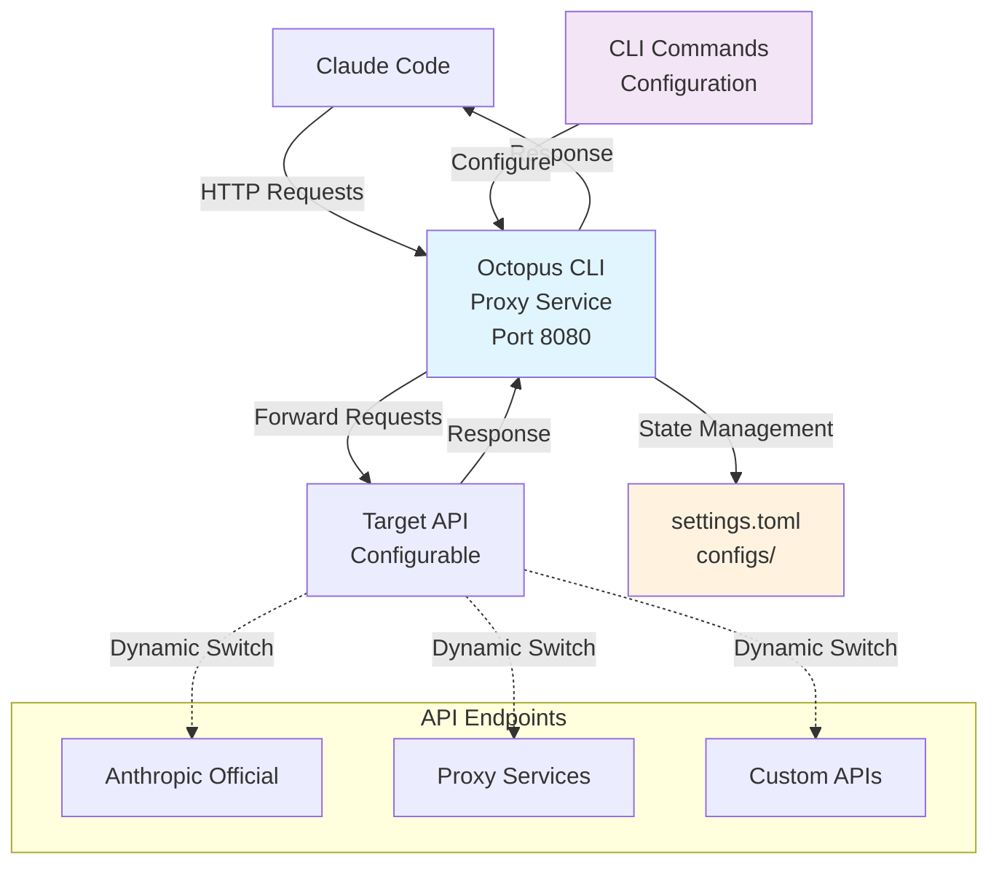

# Octopus CLI

> **English** | [中文](README_CN.md)

[](https://opensource.org/licenses/MIT)
[](https://goreportcard.com/report/github.com/VibeAny/octopus-cli)
[](https://github.com/VibeAny/octopus-cli)
[](test/reports/test-report.md)

> 🐙 A command-line tool for dynamic Claude Code API management and forwarding

## Overview

Octopus CLI is a powerful command-line tool that solves the pain point of frequently switching Claude Code API providers. Instead of manually modifying environment variables and restarting Claude Code each time, Octopus CLI provides a local proxy service that allows you to dynamically switch between multiple API configurations without any restarts.

## Key Features

- 🔀 **Dynamic API Switching** - Switch between API providers instantly without restarts
- 📄 **TOML Configuration** - Clean, readable configuration format
- 💻 **CLI Interface** - Intuitive command-line operations with colorized output
- 🔄 **Local Proxy** - Transparent HTTP proxy for Claude Code
- 🏥 **Health Checking** - Monitor API endpoint availability
- 📊 **Request Logging** - Track and monitor API usage
- 🔒 **Secure** - API keys stored securely with proper permissions
- 🎨 **Beautiful UI** - Colorized tables and status indicators with proper alignment
- 🌍 **Multi-Platform** - Native binaries for Windows, macOS, Linux (all architectures)

## Quick Start

### Installation

**Download Pre-built Binaries:**

```bash
# Available platforms:
# - Windows: amd64, arm64, 386
# - macOS: amd64, arm64 
# - Linux: amd64, arm64, 386

# Example for macOS ARM64 (Apple Silicon)
wget https://github.com/VibeAny/octopus-cli/releases/latest/download/octopus-v0.0.1-macos-arm64-YYYYMMDD.xxxxxxxx
chmod +x octopus-v0.0.1-macos-arm64-*
sudo mv octopus-v0.0.1-macos-arm64-* /usr/local/bin/octopus
```

**Build from Source:**

```bash
git clone https://github.com/VibeAny/octopus-cli.git
cd octopus-cli
make build          # Build for current platform
make build-all      # Build for all platforms
```

### Basic Usage

```bash
# Add API configurations
octopus config add official https://api.anthropic.com sk-ant-xxx
octopus config add proxy1 https://api.proxy1.com pk-xxx

# Start the proxy service
octopus start

# Configure Claude Code to use http://localhost:8080
# Now you can switch APIs dynamically:
octopus config switch proxy1
octopus config switch official

# Check status
octopus status
octopus health
```

## Commands

### Service Management
- `octopus start` - Start the proxy service
- `octopus stop` - Stop the proxy service
- `octopus status` - Show service status
- `octopus restart` - Restart the service

### Configuration Management
- `octopus config list` - List all API configurations
- `octopus config add <name> <url> <key>` - Add new API configuration
- `octopus config switch <name>` - Switch to specific API configuration
- `octopus config show <name>` - Show configuration details
- `octopus config remove <name>` - Remove API configuration

### Monitoring & Diagnostics
- `octopus health` - Check API endpoints health status
- `octopus logs` - View service logs
- `octopus version` - Show version information

## Configuration

Octopus CLI uses TOML configuration files. The default location is `~/.config/octopus/octopus.toml`.

Example configuration:
```toml
[server]
port = 8080
log_level = "info"

[[apis]]
id = "official"
name = "Anthropic Official"
url = "https://api.anthropic.com"
api_key = "sk-ant-xxx"
is_active = true

[[apis]]
id = "proxy1"
name = "Proxy Service 1"
url = "https://api.proxy1.com"
api_key = "pk-xxx"
is_active = false

[settings]
active_api = "official"
```

## Development

This project follows **Test-Driven Development (TDD)** methodology. All contributions must include comprehensive tests.

### Prerequisites
- Go 1.21 or later
- Make

### Development Setup
```bash
# Clone the repository
git clone https://github.com/VibeAny/octopus-cli.git
cd octopus-cli

# Install dependencies
go mod download

# Run tests
make test

# Run functional tests  
./test/scripts/run-functional-tests.sh

# Run tests with coverage
make test-coverage

# Build for current platform
make build

# Build for all platforms
make build-all
```

### Multi-Platform Builds

Supported platforms:
- **Windows**: amd64, arm64, 386
- **macOS**: amd64 (Intel), arm64 (Apple Silicon)
- **Linux**: amd64, arm64, 386

All binaries use the naming convention: `octopus-v0.0.1-platform-YYYYMMDD.git_sha`

### TDD Workflow
1. **Red**: Write a failing test
2. **Green**: Write minimal code to make the test pass
3. **Refactor**: Improve the code while keeping tests green

### Contributing
1. Fork the repository
2. Create a feature branch (`git checkout -b feature/amazing-feature`)
3. Write tests for your changes
4. Implement your changes following TDD
5. Ensure all tests pass (`make test`)
6. Commit your changes (`git commit -m 'feat: add amazing feature'`)
7. Push to the branch (`git push origin feature/amazing-feature`)
8. Open a Pull Request

## Architecture



## Roadmap

- [x] Phase 1: Project Setup & Documentation
- [x] Phase 2: Go Project Initialization  
- [x] Phase 3: CLI Architecture Implementation
- [x] Phase 4: Core Proxy Functionality (TDD)
- [x] Phase 5: CLI Command Implementation (TDD)
- [x] Phase 6: User Experience Optimization ✨ **Complete**
  - [x] Colorized output with beautiful table formatting
  - [x] Multi-platform build system (8 platforms)
  - [x] Table alignment fix for colored text
- [ ] Phase 7: Testing & Documentation
- [ ] Phase 8: Release Preparation

**Current Status**: 🚀 **Enhanced MVP** - Core functionality + UX optimizations complete

## Testing

This project maintains high quality standards with comprehensive testing:

- **Unit Tests**: 126 tests covering all modules
- **Functional Tests**: 26 tests covering end-to-end scenarios  
- **Test Coverage**: 100% functional coverage
- **TDD Methodology**: All features developed test-first

See [test documentation](test/) for more details.

## License

This project is licensed under the MIT License - see the [LICENSE](LICENSE) file for details.

## Support

- 📚 [Documentation](docs/)
- 🐛 [Issue Tracker](https://github.com/VibeAny/octopus-cli/issues)
- 💬 [Discussions](https://github.com/VibeAny/octopus-cli/discussions)
