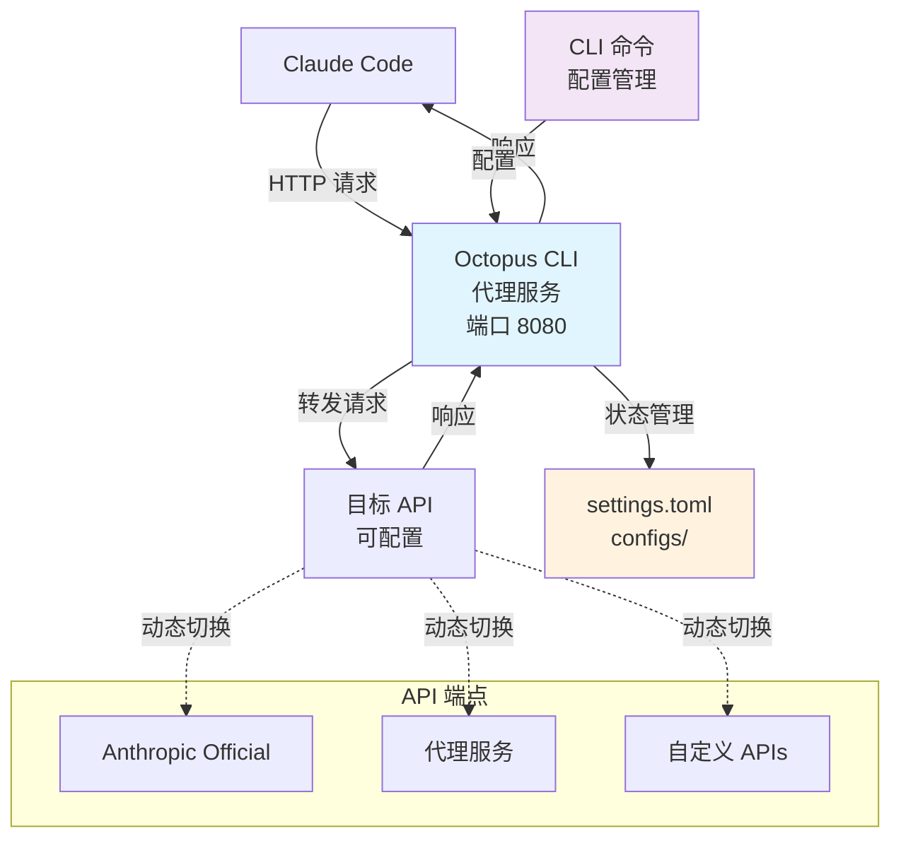

# Octopus CLI

> [English](README.md) | **中文**

[](https://opensource.org/licenses/MIT)
[](https://goreportcard.com/report/github.com/VibeAny/octopus-cli)
[](https://github.com/VibeAny/octopus-cli)
[](test/reports/test-report.md)

> 🐙 动态 Claude Code API 管理和转发的命令行工具

## 概述

Octopus CLI 是一个强大的命令行工具，解决了频繁切换 Claude Code API 提供商的痛点。不需要手动修改环境变量和每次重启 Claude Code，Octopus CLI 提供本地代理服务，让您可以动态切换多个 API 配置而无需重启。

## 核心功能

- 🔀 **动态 API 切换** - 即时切换 API 提供商无需重启
- 📄 **TOML 配置** - 清晰易读的配置格式
- 💻 **CLI 界面** - 直观的命令行操作和彩色输出
- 📝 **配置编辑器** - 使用系统默认编辑器编辑配置文件
- 🔄 **本地代理** - 为 Claude Code 提供透明 HTTP 代理
- 🏥 **健康检查** - 监控 API 端点可用性
- 📊 **请求日志** - 跟踪和监控 API 使用情况，支持实时日志跟踪
- 🔒 **安全** - API 密钥安全存储，权限管理
- 🎨 **美观界面** - 彩色表格和状态指示器，支持正确对齐
- 🚀 **自动升级** - 与 GitHub Releases 集成的无缝升级系统
- 🌍 **多平台** - Windows, macOS, Linux 原生二进制文件（支持所有架构）

## 快速开始

### 安装

**快速安装 (推荐):**

#### 快速安装最新版本

```bash
curl -fsSL https://raw.githubusercontent.com/VibeAny/octopus-cli/main/install.sh | bash
```

#### 或者使用 wget

```bash

wget -qO- https://raw.githubusercontent.com/VibeAny/octopus-cli/main/install.sh | bash
```

**下载预编译二进制文件：**

```bash
# 支持的平台：
# - Windows: amd64, arm64, 386
# - macOS: amd64, arm64
# - Linux: amd64, arm64, 386

# macOS ARM64 (Apple Silicon) 示例
wget https://github.com/VibeAny/octopus-cli/releases/latest/download/octopus-v0.0.1-macos-arm64-YYYYMMDD.xxxxxxxx
chmod +x octopus-v0.0.1-macos-arm64-*
sudo mv octopus-v0.0.1-macos-arm64-* /usr/local/bin/octopus
```

**从源码编译：**

```bash
git clone https://github.com/VibeAny/octopus-cli.git
cd octopus-cli
make build          # 编译当前平台
make build-all      # 编译所有平台
```

### 基本使用

```bash
# 1. 添加API配置
octopus config add official https://api.anthropic.com sk-ant-xxx
octopus config add proxy1 https://api.proxy1.com pk-xxx

# 2. 启动代理服务
octopus start

# 3. 配置 Claude Code 环境变量
export ANTHROPIC_BASE_URL="http://localhost:8080"
export ANTHROPIC_API_KEY="dummy-key-will-be-overridden"

# 4. 现在您可以动态切换API：
octopus config switch proxy1
octopus config switch official

# 5. 检查状态和健康
octopus status
octopus health

# 6. 保持安装更新：
octopus upgrade --check    # 检查升级
octopus upgrade           # 升级到最新版本
```

### Claude Code 配置

安装 Octopus CLI 后，您需要配置 Claude Code 使用本地代理：

#### 方法1：环境变量 (推荐)

**Linux/macOS:**
```bash
# 添加到您的 ~/.bashrc, ~/.zshrc, 或 ~/.profile
export ANTHROPIC_BASE_URL="http://localhost:8080"
export ANTHROPIC_API_KEY="dummy-key"  # 将被 Octopus 覆盖

# 重新加载 shell 或运行：
source ~/.bashrc  # 或 ~/.zshrc
```

**Windows PowerShell:**
```powershell
# 添加到您的 PowerShell 配置文件
[Environment]::SetEnvironmentVariable("ANTHROPIC_BASE_URL", "http://localhost:8080", "User")
[Environment]::SetEnvironmentVariable("ANTHROPIC_API_KEY", "dummy-key", "User")

# 或仅为当前会话设置：
$env:ANTHROPIC_BASE_URL = "http://localhost:8080"
$env:ANTHROPIC_API_KEY = "dummy-key"
```

**Windows 命令提示符:**
```cmd
# 永久设置
setx ANTHROPIC_BASE_URL "http://localhost:8080"
setx ANTHROPIC_API_KEY "dummy-key"

# 或仅为当前会话设置：
set ANTHROPIC_BASE_URL=http://localhost:8080
set ANTHROPIC_API_KEY=dummy-key
```

#### 方法2：Claude Code 设置

通过 Claude Code 的设置界面配置使用本地代理端点 `http://localhost:8080`。具体方法取决于您的 Claude Code 版本和界面。

请查阅 Claude Code 的文档了解适合您版本的具体配置方法。

#### 验证配置

验证配置是否正常工作：

```bash
# 启动 Octopus CLI
octopus start

# 检查 Claude Code 是否在使用代理
octopus logs -f

# 您应该在日志中看到来自 Claude Code 的请求
```

## 命令

### 服务管理

- `octopus start` - 启动代理服务
- `octopus stop` - 停止代理服务
- `octopus status` - 显示服务状态
- `octopus restart` - 重启服务

### 配置管理

- `octopus config list` - 列出所有 API 配置
- `octopus config add <名称> <URL> <密钥>` - 添加新的 API 配置
- `octopus config switch <名称>` - 切换到指定 API 配置
- `octopus config show <名称>` - 显示配置详情
- `octopus config remove <名称>` - 删除 API 配置
- `octopus config edit` - 使用系统编辑器编辑配置文件

### 监控与诊断

- `octopus health` - 检查 API 端点健康状态
- `octopus logs` - 查看服务日志
- `octopus logs -f` - 实时跟踪服务日志
- `octopus version` - 显示版本信息

### 软件管理

- `octopus upgrade` - 升级到最新版本
- `octopus upgrade --check` - 检查可用升级但不安装
- `octopus upgrade --force` - 强制升级无需确认

## 配置

Octopus CLI 使用 TOML 配置文件。配置文件的默认位置：

- **Linux**: `~/.octopus/octopus.toml`
- **macOS**: `~/Library/Application Support/Octopus/octopus.toml`
- **Windows**: `%APPDATA%\Octopus\octopus.toml`

配置示例：

```toml
[server]
port = 8080
log_level = "info"

[[apis]]
id = "official"
name = "Anthropic Official"
url = "https://api.anthropic.com"
api_key = "sk-ant-xxx"
is_active = true

[[apis]]
id = "proxy1"
name = "Proxy Service 1"
url = "https://api.proxy1.com"
api_key = "pk-xxx"
is_active = false

[settings]
active_api = "official"
```

## 开发

本项目严格遵循 **测试驱动开发 (TDD)** 方法论。所有贡献都必须包含完整的测试。

### 前置要求

- Go 1.21 或更高版本
- Make

### 开发环境设置

```bash
# 克隆仓库
git clone https://github.com/VibeAny/octopus-cli.git
cd octopus-cli

# 安装依赖
go mod download

# 运行测试
make test

# 运行功能测试
./test/scripts/run-functional-tests.sh

# 运行覆盖率测试
make test-coverage

# 编译当前平台
make build

# 编译所有平台
make build-all
```

### 多平台构建

支持的平台：

- **Windows**: amd64, arm64, 386
- **macOS**: amd64 (Intel), arm64 (Apple Silicon)
- **Linux**: amd64, arm64, 386

所有二进制文件使用命名规范：`octopus-v0.0.1-platform-YYYYMMDD.git_sha`

### TDD 工作流

1. **红色**: 编写失败的测试
2. **绿色**: 编写最小代码使测试通过
3. **重构**: 在保持测试通过的同时改进代码

### 贡献

1. Fork 仓库
2. 创建功能分支 (`git checkout -b feature/amazing-feature`)
3. 为你的更改编写测试
4. 遵循 TDD 实现你的更改
5. 确保所有测试通过 (`make test`)
6. 提交你的更改 (`git commit -m 'feat: add amazing feature'`)
7. 推送到分支 (`git push origin feature/amazing-feature`)
8. 打开一个 Pull Request

## 架构



## 路线图

- [x] Phase 1: 项目设置与文档
- [x] Phase 2: Go 项目初始化
- [x] Phase 3: CLI 架构实现
- [x] Phase 4: 核心代理功能 (TDD)
- [x] Phase 5: CLI 命令实现 (TDD)
- [x] Phase 6: 用户体验优化 ✨ **完成**
  - [x] 彩色输出和美观表格格式化
  - [x] 多平台构建系统 (8 个平台)
  - [x] 彩色文本表格对齐修复
- [ ] Phase 7: 测试与文档
- [ ] Phase 8: 发布准备

**当前状态**: 🚀 **增强 MVP** - 核心功能 + UX 优化完成

## 测试

本项目保持高质量标准和完整测试：

- **单元测试**: 126 个测试覆盖所有模块
- **功能测试**: 26 个测试覆盖端到端场景
- **测试覆盖率**: 100% 功能覆盖率
- **TDD 方法论**: 所有功能都采用测试先行开发

查看 [测试文档](test/) 了解更多详情。

## 许可证

本项目采用 MIT 许可证 - 查看 [LICENSE](LICENSE) 文件了解详情。

## 支持

- 📚 [文档](docs/)
- 🐛 [问题跟踪](https://github.com/VibeAny/octopus-cli/issues)
- 💬 [讨论区](https://github.com/VibeAny/octopus-cli/discussions)

