# Octopus CLI

> [English](README.md) | **中文**

[](https://opensource.org/licenses/MIT)
[](https://goreportcard.com/report/github.com/VibeAny/octopus-cli)
[](https://github.com/VibeAny/octopus-cli)
[](test/reports/test-report.md)

> 🐙 动态Claude Code API管理和转发的命令行工具

## 概述

Octopus CLI 是一个强大的命令行工具，解决了频繁切换 Claude Code API 提供商的痛点。不需要手动修改环境变量和每次重启 Claude Code，Octopus CLI 提供本地代理服务，让您可以动态切换多个 API 配置而无需重启。

## 核心功能

- 🔀 **动态API切换** - 即时切换API提供商无需重启
- 📄 **TOML配置** - 清晰易读的配置格式
- 💻 **CLI界面** - 直观的命令行操作和彩色输出
- 🔄 **本地代理** - 为Claude Code提供透明HTTP代理
- 🏥 **健康检查** - 监控API端点可用性
- 📊 **请求日志** - 跟踪和监控API使用情况
- 🔒 **安全** - API密钥安全存储，权限管理
- 🎨 **美观界面** - 彩色表格和状态指示器，支持正确对齐
- 🌍 **多平台** - Windows, macOS, Linux 原生二进制文件（支持所有架构）

## 快速开始

### 安装

**一键安装 (推荐):**

```bash
# 一条命令安装最新版本 (类似 oh-my-zsh)
curl -fsSL https://raw.githubusercontent.com/VibeAny/octopus-cli/main/install.sh | bash

# 或者使用 wget
wget -qO- https://raw.githubusercontent.com/VibeAny/octopus-cli/main/install.sh | bash
```

**下载预编译二进制文件：**

```bash
# 支持的平台：
# - Windows: amd64, arm64, 386
# - macOS: amd64, arm64 
# - Linux: amd64, arm64, 386

# macOS ARM64 (Apple Silicon) 示例
wget https://github.com/VibeAny/octopus-cli/releases/latest/download/octopus-v0.0.1-macos-arm64-YYYYMMDD.xxxxxxxx
chmod +x octopus-v0.0.1-macos-arm64-*
sudo mv octopus-v0.0.1-macos-arm64-* /usr/local/bin/octopus
```

**从源码编译：**

```bash
git clone https://github.com/VibeAny/octopus-cli.git
cd octopus-cli
make build          # 编译当前平台
make build-all      # 编译所有平台
```

### 基本使用

```bash
# 添加API配置
octopus config add official https://api.anthropic.com sk-ant-xxx
octopus config add proxy1 https://api.proxy1.com pk-xxx

# 启动代理服务
octopus start

# 配置 Claude Code 使用 http://localhost:8080
# 现在您可以动态切换API：
octopus config switch proxy1
octopus config switch official

# 检查状态
octopus status
octopus health
```

## 命令

### 服务管理
- `octopus start` - 启动代理服务
- `octopus stop` - 停止代理服务
- `octopus status` - 显示服务状态
- `octopus restart` - 重启服务

### 配置管理
- `octopus config list` - 列出所有API配置
- `octopus config add <名称> <URL> <密钥>` - 添加新的API配置
- `octopus config switch <名称>` - 切换到指定API配置
- `octopus config show <名称>` - 显示配置详情
- `octopus config remove <名称>` - 删除API配置

### 监控与诊断
- `octopus health` - 检查API端点健康状态
- `octopus logs` - 查看服务日志
- `octopus version` - 显示版本信息

## 配置

Octopus CLI 使用 TOML 配置文件。默认位置是当前目录的 `configs/default.toml`。

配置示例：
```toml
[server]
port = 8080
log_level = "info"

[[apis]]
id = "official"
name = "Anthropic Official"
url = "https://api.anthropic.com"
api_key = "sk-ant-xxx"
is_active = true

[[apis]]
id = "proxy1"
name = "Proxy Service 1"
url = "https://api.proxy1.com"
api_key = "pk-xxx"
is_active = false

[settings]
active_api = "official"
```

## 开发

本项目严格遵循 **测试驱动开发 (TDD)** 方法论。所有贡献都必须包含完整的测试。

### 前置要求
- Go 1.21 或更高版本
- Make

### 开发环境设置
```bash
# 克隆仓库
git clone https://github.com/VibeAny/octopus-cli.git
cd octopus-cli

# 安装依赖
go mod download

# 运行测试
make test

# 运行功能测试  
./test/scripts/run-functional-tests.sh

# 运行覆盖率测试
make test-coverage

# 编译当前平台
make build

# 编译所有平台
make build-all
```

### 多平台构建

支持的平台：
- **Windows**: amd64, arm64, 386
- **macOS**: amd64 (Intel), arm64 (Apple Silicon)
- **Linux**: amd64, arm64, 386

所有二进制文件使用命名规范：`octopus-v0.0.1-platform-YYYYMMDD.git_sha`

### TDD 工作流
1. **红色**: 编写失败的测试
2. **绿色**: 编写最小代码使测试通过
3. **重构**: 在保持测试通过的同时改进代码

### 贡献
1. Fork 仓库
2. 创建功能分支 (`git checkout -b feature/amazing-feature`)
3. 为你的更改编写测试
4. 遵循 TDD 实现你的更改
5. 确保所有测试通过 (`make test`)
6. 提交你的更改 (`git commit -m 'feat: add amazing feature'`)
7. 推送到分支 (`git push origin feature/amazing-feature`)
8. 打开一个 Pull Request

## 架构

```mermaid
graph TB
    A[Claude Code] -->|HTTP 请求| B[Octopus CLI<br/>代理服务<br/>端口 8080]
    B -->|转发请求| C[目标 API<br/>可配置]
    C -->|响应| B
    B -->|响应| A

    D[CLI 命令<br/>配置管理] -->|配置| B
    B -->|状态管理| E[settings.toml<br/>configs/]

    subgraph "API 端点"
        F[Anthropic Official]
        G[代理服务]
        H[自定义 APIs]
    end

    C -.->|动态切换| F
    C -.->|动态切换| G
    C -.->|动态切换| H

    style B fill:#e1f5fe
    style D fill:#f3e5f5
    style E fill:#fff3e0
```



## 路线图

- [x] Phase 1: 项目设置与文档
- [x] Phase 2: Go 项目初始化  
- [x] Phase 3: CLI 架构实现
- [x] Phase 4: 核心代理功能 (TDD)
- [x] Phase 5: CLI 命令实现 (TDD)
- [x] Phase 6: 用户体验优化 ✨ **完成**
  - [x] 彩色输出和美观表格格式化
  - [x] 多平台构建系统 (8个平台)
  - [x] 彩色文本表格对齐修复
- [ ] Phase 7: 测试与文档
- [ ] Phase 8: 发布准备

**当前状态**: 🚀 **增强MVP** - 核心功能 + UX优化完成

## 测试

本项目保持高质量标准和完整测试：

- **单元测试**: 126个测试覆盖所有模块
- **功能测试**: 26个测试覆盖端到端场景  
- **测试覆盖率**: 100% 功能覆盖率
- **TDD方法论**: 所有功能都采用测试先行开发

查看 [测试文档](test/) 了解更多详情。

## 许可证

本项目采用 MIT 许可证 - 查看 [LICENSE](LICENSE) 文件了解详情。

## 支持

- 📚 [文档](docs/)
- 🐛 [问题跟踪](https://github.com/VibeAny/octopus-cli/issues)
- 💬 [讨论区](https://github.com/VibeAny/octopus-cli/discussions)

## 致谢

- 感谢 Claude Code 团队创建了如此出色的开发工具
- 灵感来源于开发工作流中对无缝API切换的需求