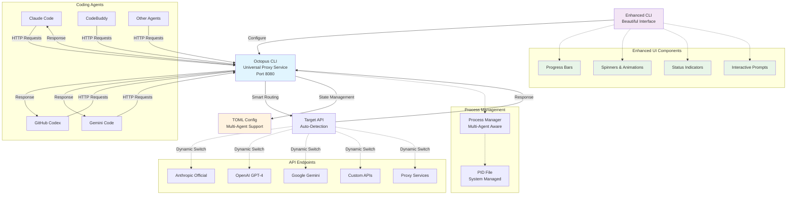

# 架构设计文档

> **版本说明**: 本文档适用于 Octopus CLI v0.1.0+  
> **重大变更**: v0.1.0 引入多代理支持和增强用户体验设计
> **向后兼容**: 完全兼容 v0.0.x 系列配置和命令

## 整体架构图



## 核心组件设计

### 1. CLI 命令接口 (CLI Interface)

**职责:**
- 解析和处理用户命令行输入
- 提供服务管理命令（start, stop, status）
- 提供配置管理命令（config add, switch, list等）
- 与后端服务通信

**接口设计:**
```go
type CLIHandler interface {
    HandleStart(args []string) error
    HandleStop(args []string) error
    HandleStatus(args []string) error
    HandleConfig(subcommand string, args []string) error
    HandleHealth(args []string) error
}
```

### 2. HTTP 代理服务器 (ProxyServer)

**职责:**
- 接收来自 Claude Code 的 HTTP 请求
- 根据当前配置转发请求到目标 API
- 返回 API 响应给客户端
- 支持后台运行

**接口设计:**
```go
type ProxyServer interface {
    Start(port int) error
    Stop() error
    IsRunning() bool
    UpdateConfig(config *APIConfig) error
    GetStats() *ServerStats
}
```

### 3. TOML 配置管理器 (ConfigManager)

**职责:**
- 管理多个 API 配置
- TOML 配置文件的读写
- 提供配置切换功能
- 配置验证和默认值处理

**接口设计:**
```go
type ConfigManager interface {
    LoadConfig() (*Config, error)
    SaveConfig(*Config) error
    AddAPIConfig(*APIConfig) error
    RemoveAPIConfig(id string) error
    SetActiveAPI(id string) error
    GetActiveAPI() (*APIConfig, error)
    ValidateConfig(*Config) error
}
```

### 4. 转发引擎 (ForwardEngine)

**职责:**
- 执行实际的 HTTP 请求转发
- 处理请求/响应的格式转换
- 错误处理和重试逻辑
- 请求日志记录

**接口设计:**
```go
type ForwardEngine interface {
    Forward(req *http.Request, config *APIConfig) (*http.Response, error)
    ValidateAPI(config *APIConfig) error
    GetHealthStatus(config *APIConfig) (*HealthStatus, error)
}
```

### 5. 进程管理器 (ProcessManager)

**职责:**
- 管理代理服务的生命周期
- 处理进程间通信
- 支持服务的后台运行
- 统一 PID 文件管理（v0.0.3+ 使用系统临时目录）

**接口设计:**
```go
type ProcessManager interface {
    StartDaemon() error
    StopDaemon() error
    GetDaemonStatus() (*ProcessStatus, error)
    SendSignal(signal os.Signal) error
    GetPIDFilePath() string  // v0.0.3+ 新增调试方法
}
```

**v0.0.3 重要变更:**
- PID 文件路径不再可配置，统一使用 `os.TempDir()/octopus.pid`
- `NewManager()` 函数签名简化：从 `NewManager(pidFile, name)` 改为 `NewManager(name)`
- 新增 `GetPIDFilePath()` 方法用于调试和状态显示

## CLI 命令架构设计

### 命令结构
```
octopus
├── start                    # 启动代理服务
├── stop                     # 停止代理服务  
├── restart                  # 重启代理服务
├── status                   # 查看服务状态
├── config
│   ├── list                 # 列出所有配置
│   ├── add <name> <url> <key> # 添加配置
│   ├── remove <id>          # 删除配置
│   ├── switch <id>          # 切换配置
│   ├── show <id>            # 显示配置详情
│   └── edit <id>            # 编辑配置
├── health                   # 健康检查
├── logs                     # 查看日志
└── version                  # 版本信息
```

### 命令处理流程
```
User Input → CLI Parser → Command Router → Handler → Action
                                    ↓
                              Config Manager ← → TOML File
                                    ↓
                              Proxy Server ← → Target API
```

## 数据流设计

### 1. 正常请求流程
```
Claude Code → HTTP Request → Proxy Server → Config Manager → Active Config
                                    ↓                              ↓
                             Forward Engine → HTTP Client → Target API
                                    ↓                              │
                             Response Handler ←─────────────────────┘
                                    ↓
                             Claude Code ← HTTP Response
```

### 2. CLI 配置切换流程
```
CLI Command → Command Parser → Config Handler → Config Manager
                                    ↓                  ↓
                              Validate Input → Update TOML File
                                    ↓                  ↓
                              Notify Proxy → Reload Config
                                    ↓
                              Return Status
```

## 目录结构设计

```
octopus-cli/
├── cmd/
│   └── octopus/
│       ├── main.go              # 主程序入口
│       ├── commands/            # CLI 命令处理
│       │   ├── start.go         # 启动命令
│       │   ├── stop.go          # 停止命令
│       │   ├── status.go        # 状态命令
│       │   ├── config.go        # 配置命令
│       │   ├── health.go        # 健康检查命令
│       │   └── logs.go          # 日志命令
│       └── root.go              # 根命令和全局配置
├── internal/
│   ├── config/
│   │   ├── manager.go           # TOML 配置管理器
│   │   ├── types.go             # 配置数据结构
│   │   └── validator.go         # 配置验证
│   ├── proxy/
│   │   ├── server.go            # HTTP 代理服务器
│   │   ├── forward.go           # 转发引擎
│   │   └── middleware.go        # 请求中间件
│   ├── api/
│   │   ├── management.go        # 管理API (可选)
│   │   └── handlers.go          # HTTP处理器
│   ├── process/
│   │   ├── manager.go           # 进程管理器
│   │   └── daemon.go            # 守护进程
│   ├── cli/
│   │   ├── handler.go           # CLI命令处理
│   │   └── ui.go                # 用户界面
│   └── utils/
│       ├── logger.go            # 日志工具
│       ├── validator.go         # 验证工具
│       └── health.go            # 健康检查
├── pkg/
│   └── client/
│       └── client.go            # 客户端SDK (可选)
├── configs/
│   ├── default.toml             # 默认配置模板
│   └── octopus.toml            # 用户配置
├── docs/                        # 文档目录
├── scripts/                     # 构建和安装脚本
├── Makefile                     # 构建脚本
├── go.mod                       # Go模块
└── README.md                    # 项目说明
```

## TOML 配置文件架构

### 配置文件结构
```toml
# 服务器配置
[server]
port = 8080
log_level = "info"
daemon = true
# 注意：v0.0.3+ 已移除 pid_file 配置，系统自动管理

# API 配置数组
[[apis]]
id = "official"
name = "Anthropic Official"
url = "https://api.anthropic.com"
api_key = "sk-xxx"
is_active = true
timeout = 30
retry_count = 3

[[apis]]
id = "proxy1"
name = "Proxy Service 1"
url = "https://api.proxy1.com"
api_key = "pk-xxx"
is_active = false
timeout = 30
retry_count = 3

# 全局设置
[settings]
active_api = "official"
log_file = "/tmp/octopus.log"
config_backup = true
```

### 配置优先级
1. 命令行参数 (最高优先级)
2. 环境变量
3. 用户配置文件 (~/.config/octopus/octopus.toml)
4. 系统配置文件 (/etc/octopus/octopus.toml)
5. 默认配置 (最低优先级)

## 进程架构设计

### 单进程模式
```
CLI Command → 直接操作 → 配置文件
     ↓
启动内嵌 HTTP 服务器 → 前台运行
```

### 守护进程模式
```
CLI Command → IPC/HTTP API → 后台守护进程
                                   ↓
                            HTTP 代理服务器 → 持续运行
```

## 安全架构

### 1. 配置文件安全
- 配置文件权限设置为 600 (仅用户可读写)
- API Key 加密存储 (可选)
- 敏感信息脱敏日志

### 2. 进程安全
- PID 文件锁定防止重复启动（v0.0.3+ 统一使用系统临时目录）
- 信号处理确保优雅关闭
- 临时文件安全清理
- 跨平台临时目录权限管理

### 3. 网络安全
- 仅监听本地接口 (127.0.0.1)
- 可选的简单认证机制
- 请求大小限制

## 错误处理架构

### 错误分类
1. **配置错误**: 配置文件格式错误、缺少必需字段
2. **网络错误**: API 连接失败、超时
3. **系统错误**: 权限不足、磁盘空间不足
4. **业务错误**: API 密钥无效、配置冲突

### 错误处理策略
1. **分层错误处理**: 每层处理对应类型的错误
2. **结构化错误**: 统一的错误格式和错误码
3. **用户友好**: 清晰的错误提示和建议
4. **错误恢复**: 自动重试和降级策略

## 扩展架构

### 插件系统 (可选)
```go
type Plugin interface {
    Name() string
    Version() string
    Init(config map[string]interface{}) error
    Handle(req *http.Request, resp *http.Response) error
}
```

### 监控集成 (可选)
- Prometheus metrics 导出
- 健康检查端点
- 性能指标收集